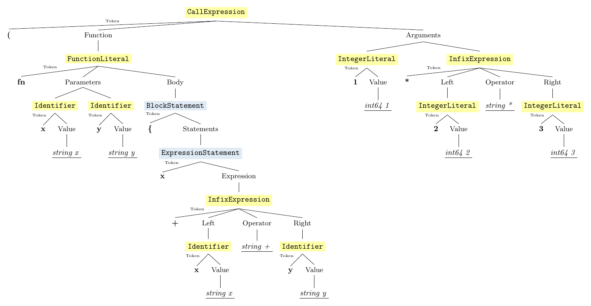
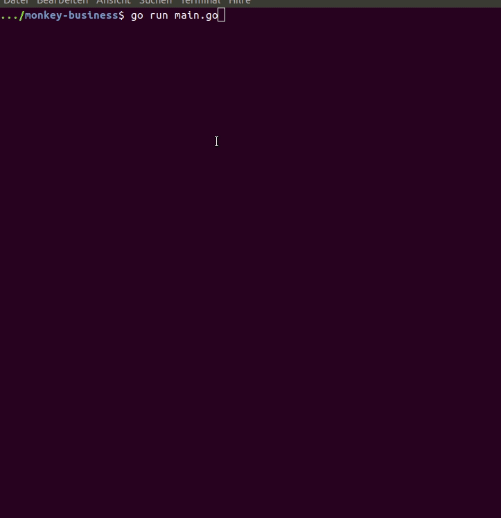
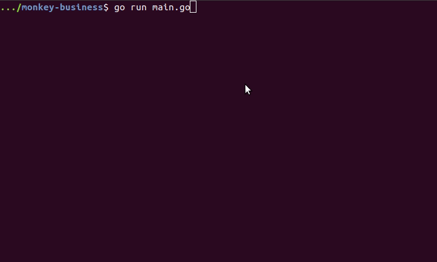

# Extending the interpreter and its interactive environment

_The purpose of the Monkey Programming Language is to learn different aspects of implementing a language. The main purpose of this repo is for me to learn go by fooling around. In addition, it serves the purpose of plunging into the business of interpreting Monkey PL more systematically. It reveals bugs in the original software by adding tests and offers fixes for these bugs. Moreover, it extends the interactive environment such that a use can gain more insight into the structure of the chosen abstract syntax tree (ast) and the steps of interpretation. At least, that's the plan..._

 _to be continued..._

## Step 4: Add representation of asts 

#### As pdf

TODO: 
- doc setting incltoken
- doc tree-output

#### In the console
If the setting `logtype` is set or the command `parse` is used, the output so far was just the output of the `String()`-method that nodes provide. Now, there is a more detailed representation provided.

Expression nodes are colored in yellow, statement nodes in blue and program nodes in a darker blue. The colors don't work for windows users.

## Step 3: Add dimensions: settings `level <l>` and `process 
`

#### `(set|reset) level (program|statement|expression)`

Every ast node is either a program, a statement or an expression. Until now, we treat each input as a program, which means, we can also only evaluate a program and show the type for the evaluation result of a program.
In this step, we implement another setting that chooses to parse and thus further evaluate the input as either program,statement or expression.
In addition, the commands `expr[ession]`, `stmt|statement` and `prog[ram]` are implemented.

#### `(set|reset) process (parse|eval|type)`

Furthermore, we implement settings for the way the input is to be processed: it can either be only parsed (`parse`) and output the ast, which implements the Stringer interface, or evaluated and output, which type the value is (`type`) or the value of the object via the `Inspect()`-method of objects (`eval`). The commands `type`, `eval` and `parse` behave exactly as if `process (parse|eval|type)` were set for a single command. Since, `type` and `eval` are already implemented, only `parse` is added.

Logging can be extended by the setting `logparse`, which additionally outputs the ast as string.

The full instruction set is now:

| NAME           |                   | USAGE                                                    |
--- | --- | --- |
| clear          | ~                 | clear the environment                                    |
| e[val]         | ~ `<input>`         | print out value of object `<input>` evaluates to           |
| expr[ession]   | ~ `<input>`         | expect `<input>` to be an expression                       |
| h[elp]         | ~                 | list all commands with usage                             |
|                | ~ `<cmd>`           | print usage command `<cmd>`                                |
| l[ist]         | ~                 | list all identifiers in the environment alphabetically   |
|                |                   |      with types and values                               |
| p[arse]        | ~ `<input>`         | parse `<input>`                                            |
| paste          | ~ `<input>`         | evaluate multiline `<input>` (terminated by blank line)    |
| prog[ram]      | ~ `<input>`         | expect `<input>` to be a program                           |
| q[uit]         | ~                 | quit the session                                         |
| reset          | ~ process         | set process to default                                   |
|                | ~ level           | set level to default                                     |
|                | ~ logparse        | set logparse to default                                  |
|                | ~ logtype         | set logtype to default                                   |
|                | ~ paste           | set multiline support to default                         |
|                | ~ prompt          | set prompt to default                                    |
| set            | ~ process `
`     | `
` must be: [e]val, [p]arse, [t]ype                     |
|                | ~ level `<l>`       | `<l>` must be: [p]rogram, [s]tatement, [e]xpression        |
|                | ~ logparse        | additionally output ast-string                           |
|                | ~ logtype         | additionally output objecttype                           |
|                | ~ paste           | enable multiline support                                 |
|                | ~ prompt `<prompt>` | set prompt string to `<prompt>`                            |
| settings       | ~                 | list all settings with their current values and defaults |
| stmt|statement | ~ `<input>`         | expect `<input>` to be a statement                         |
| t[ype]         | ~ `<input>`         | show objecttype `<input>` evaluates to                     |
| unset          | ~ logparse        | don't additionally output ast-string                     |
|                | ~ logtype         | don't additionally output objecttype                     |
|                | ~ paste           | disable multiline support                                |

## Step 2: Implement a small initial instruction set for the interactive environment

- new interactive environment in directory `session`
    - inspo from [ghci](https://downloads.haskell.org/~ghc/latest/docs/html/users_guide/ghci.html#ghci-commands) and [gore](https://github.com/motemen/gore) 

| NAME   |                   | USAGE                                                   |
|--------|-------------------|---------------------------------------------------------|
| clear    | ~                 | clear the environment                                    |
| e[val]   | ~ `<input>`         | print out value of object `<input>` evaluates to           |
| h[elp]   | ~                 | list all commands with usage                             |
|          | ~ `<cmd> `          | print usage command `<cmd>`                                |
| l[ist]   | ~                 | list all identifiers in the environment alphabetically   |
|          |                   |      with types and values                               |
| paste    | ~ `<input>`         | evaluate multiline `<input>` (terminated by blank line)    |
| q[uit]   | ~                 | quit the session                                         |
| reset    | ~ logtype         | set logtype to default                                   |
|          | ~ paste           | set multiline support to default                         |
|          | ~ prompt          | set prompt to default                                    |
| set      | ~ logtype         | when eval, additionally output objecttype                |
|          | ~ paste           | enable multiline support                                 |
|          | ~ prompt `<prompt>` | set prompt string to `<prompt> `                           |
| settings | ~                 | list all settings with their current values and defaults |
| t[ype]   | ~ `<input>`         | show objecttype `<input>` evaluates to                     |
| unset    | ~ logtype         | when eval, don't additionally output objecttype          |
|          | ~ paste           | disable multiline support                                |

- if `input` is not prefixed by `:<cmd>`, it is equivalent to `:eval input`

## Step 1: Write Tests for bugs in parser and evaluator

- `parser/parser_add_test.go`
- `evaluator/evaluator_add_test.go`

## Step 0: Starting Point: Copy the Code

- unaltered code from the book [_Writing an Interpreter in Go_](https://interpreterbook.com/), Version 1.7

