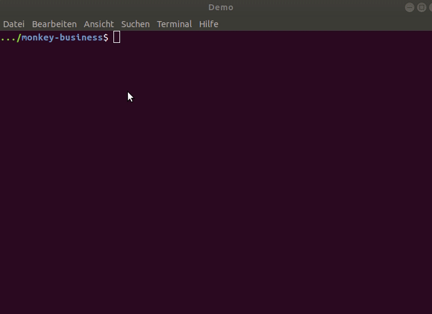
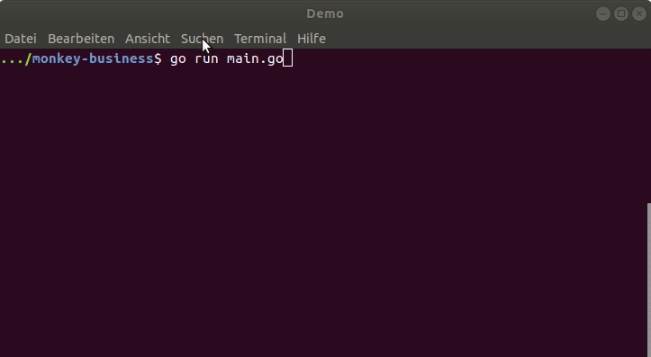
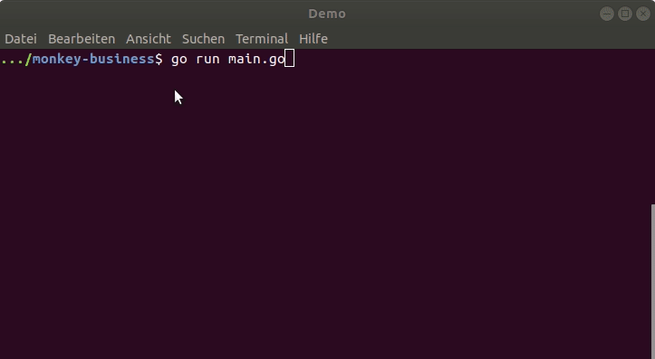
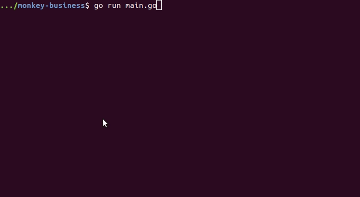

# Extending the interpreter and its interactive environment

 _to be continued..._

## Step 2: Implement a Small Initial Instruction Set for the interactive environment

- new interactive environment in directory `session`
    - inspo from [ghci](https://downloads.haskell.org/~ghc/latest/docs/html/users_guide/ghci.html#ghci-commands) and [gore](https://github.com/motemen/gore) 

### `clear`, `h[elp]`, `q[uit]`, `set prompt <prompt>`

### `reset prompt`, `list` 

### `t[ype]`,  `(set|unset|reset) logtype`, `e[val]`
- eval is default
    - if the user input is not prefixed by `:`, `input` is equivalent to `:eval input`

### Multiline support: `paste`, `(set|unset|reset) paste`

TODO: 

## Step 1: Writing Tests for Bugs in Parser and Evaluator

- `parser/parser_add_test.go`
- `evaluator/evaluator_add_test.go`

## Step 0: Starting Point: Copy the Code

- unaltered code from the book [_Writing an Interpreter in Go_](https://interpreterbook.com/), Version 1.7

