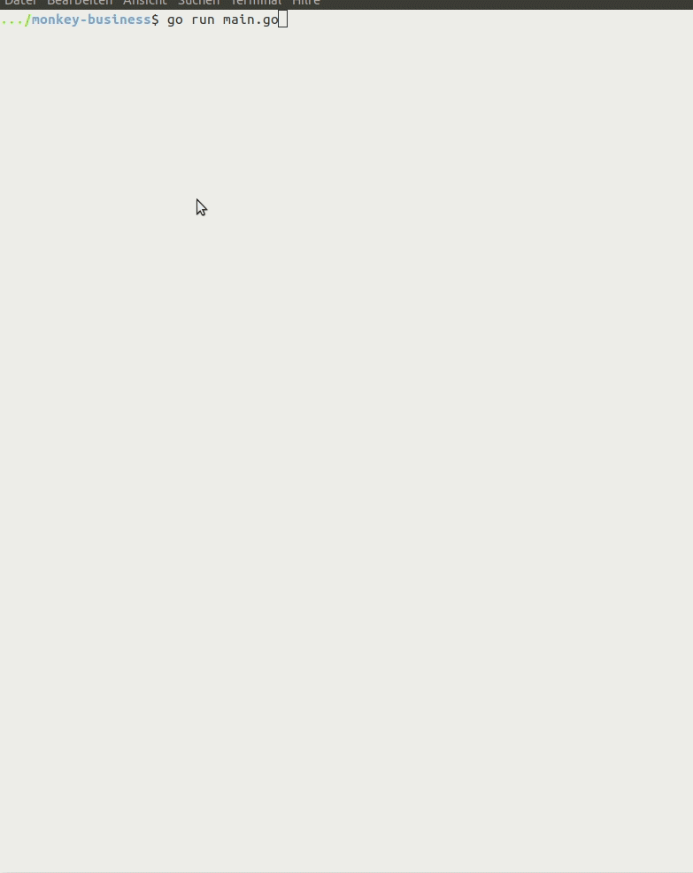

# Extending the interpreter and its interactive environment

_The purpose of the Monkey Programming Language is to learn different aspects of implementing a language. It was invented by Thorsten Ball, who offers an implementation in his book [Writing An Interpreter In Go](https://interpreterbook.com/).
The main purpose of this repo is to extend the possibilities to explore this language by the help of various visualizations of the chosen abstract syntax tree (ast) and the steps of evaluation. These visualizations can be requested by an extended interactive environment that offers a set of multidimensional options and tools for convenience.
Since Monkey is a language intended for learning purposes, the implementations are designed in such a way that they are open for changes and additions to the parser and evaluator. There is also a set of tests that may give rise to changes in the implementation, because they document certain problems within the interpreter in the state described in the book._

## Project Status

**Currently, this repo is still very much work in progress. This README so far documents important steps in the development. Once the overall functionality is finally determined, there is a restructuring of the documentation intended.**

TODO - link to changelog!

## The New Interactive Environment

- implemented in monkey/session
- replaces monkey/repl
- still called in main.go

### Run

#### Prerequisites [not tested yet, TODO]

In addition to go,  the command `pdflatex` needs to be installed for creating pdfs. 
You can check whether `pdflatex` is installed by `which pdflatex`.


For Ubuntu, the installation can be done by:

```sh
sudo apt-get install texlive-base texlive-latex-extra
```


#### Run locally

Cou can use the interactive environment locally by cloning this repo, moving into it and then execute

```sh
go run main.go
```

The interpreter code (i.e. the modules monkey/{token,lexer,ast,parser,object,evaluator}) is the original code from the interpreter book (Version 1.7) with only very few alterations described here (TODO).

You can alter the code or add to it and visualize the differences in the interactive environment.

A starting points for altering might be the additional tests

### How-To Use: TODO 

- [ ] see (yet non-existent) User Manual
- [ ] maybe small demo

## Discussion of the Interpreter: TODO 
- [ ] see (yet non-existent)doc-discussion
- [ ] see tests + their doc (add links)

## Credits 
- original interpreter code: [Writing An Interpreter In Go](https://interpreterbook.com/)
- inspiration for command sets in interactive environments: 
 [swipl](https://www.swi-prolog.org/) and
 [ghci](https://downloads.haskell.org/~ghc/latest/docs/html/users_guide/ghci.html#ghci-commands) 
- inspiration for implementing an interactive environment in go: [gore](https://github.com/motemen/gore) 

## License

[MIT LICENSE](LICENSE)


---

## Step 5: Add representations of evaluation

 _to be continued..._

### Add representations of environments to command `trace`

The command `trace` now provides possibilities for displaying environments

- for each evaluation step, it displays a short name - e.g. `e0` - of the environment used in this step.
- if the user hits `e`, it displays the current state of this environment.
- if the the current environment changes, this is indicated by printing the environment in red.
  - changes can either be:
    - the evaluation switches to another environment
    - the current environment has been changed

#### An example


#### A demo


### As pdf

- version 0 - dags are represented by node duplication
- new setting: `evalfile`

| NAME           |                   | USAGE                                                    |
--- | --- | --- |
| (set)          | ~ evalfile `<f>`   | set file that outputs  eval-pdfs to `<f>`                        |


- expl for evaluation of the program `if(true){}`:


### In the console - version 2

- TODO: _add verbosity by displaying info on environment_

### In the console - version 1
inspo from [swipl](https://www.swi-prolog.org/)

If the setting `logtrace` is set, the evaluation trace is still output in a table.

If the command `trace` is used, the evaluation trace is output step by step - this can be interrupted by typing `a`.


#### New instructions

| NAME           |                   | USAGE                                                    |
--- | --- | --- |
| trace          | ~ `<input>`         | show evaluation trace step by step                       |
| (set)          | ~ logtrace        | additionally output evaluation trace                     |


### In the console - version 0
If the setting `logtrace` is set or the command `trace` is used, the evaluation trace is output.


## Step 4: Add representations of asts 


- new instruction set: 

| NAME           |                   | USAGE                                                    |
--- | --- | --- |
| cl[earscreen]  | ~                 | clear the terminal screen                                |
| clear          | ~                 | clear the environment                                    |
| e[val]         | ~ `<input>`         | print out value of object `<input>` evaluates to           |
| expr[ession]   | ~ `<input>`         | expect `<input>` to be an expression                       |
| h[elp]         | ~                 | list all commands with usage                             |
|                | ~ `<cmd>`           | print usage command `<cmd>`                                |
| l[ist]         | ~                 | list all identifiers in the environment alphabetically   |
|                |                   |      with types and values                               |
| p[arse]        | ~ `<input>`         | parse `<input>`                                            |
| paste          | ~ `<input>`         | evaluate multiline `<input>` (terminated by blank line)    |
| prog[ram]      | ~ `<input>`         | expect `<input>` to be a program                           |
| q[uit]         | ~                 | quit the session                                         |
| reset          | ~ `<setting>`       | set `<setting>` to default                                 |
|                |                   |      for an overview consult :settings and/or :h set     |
| set            | ~ process `<p>`     | `<p>` must be: [e]val, [p]arse, [t]ype                     |
|                | ~ level `<l>`       | `<l>` must be: [p]rogram, [s]tatement, [e]xpression        |
|                | ~ logparse        | additionally output ast-string                           |
|                | ~ logtype         | additionally output objecttype                           |
|                | ~ incltoken       | include tokens in representations of asts                |
|                | ~ paste           | enable multiline support                                 |
|                | ~ prompt `<prompt>` | set prompt string to `<prompt>`                            |
|                | ~ treefile `<f>`    | set file that outputs pdfs to `<f>`                        |
| settings       | ~                 | list all settings with their current values and defaults |
| stmt|statement | ~ `<input>`         | expect `<input>` to be a statement                         |
| t[ype]         | ~ `<input>`         | show objecttype `<input>` evaluates to                     |
| unset          | ~ `<setting>`       | set boolean `<setting>` to false                           |
|                |                   |      for an overview consult :settings and/or :h set     |

#### As pdf


#### In the console
If the setting `logtype` is set or the command `parse` is used, the output so far was just the output of the `String()`-method that nodes provide. Now, there is a more detailed representation provided.

Expression nodes are colored in yellow, statement nodes in blue and program nodes in a darker blue. The colors don't work for windows users.


