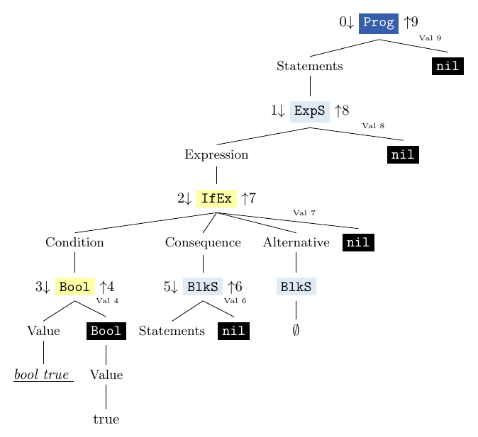
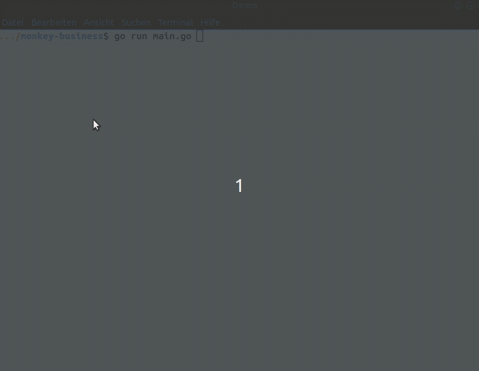
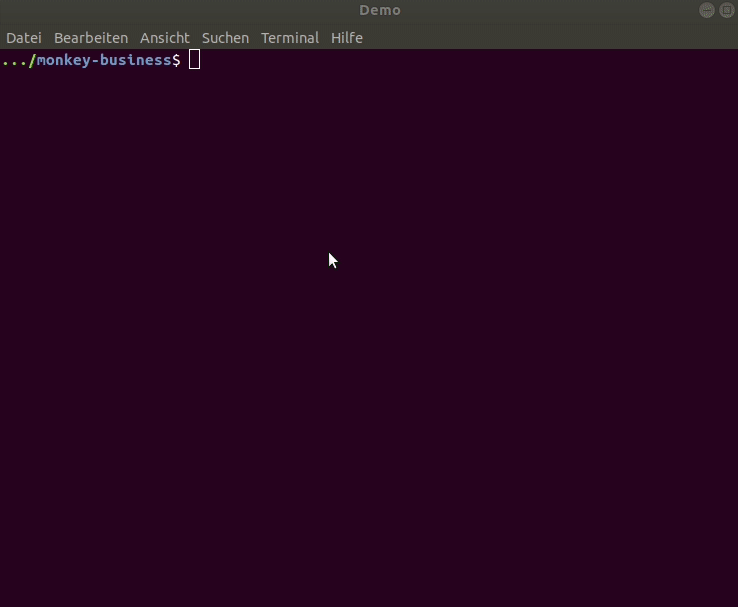

# Changelog

Started late: on 2021-04-20

## [Current]

### 2021-04-20

- reorganize documentation
  - add changelog
  - restructure main README

### 2021-04-25

- reorganize instruction set
  - add "c" for command "c[lear]"
  - add "tr" for command "tr[ace]"
  - add single command "reset" -> reset all settings
  - add commands "p[arse]tree" and "e[val]tree"
  - choose order of commands in menu
- check paths for "clear" and "pdflatex" at beginning
  - choose function for command "clearpage" when session is constructed
- reorganize settings

#### Commands new:

```
+----------------+------------------------------+---------------------------------------------------------+
| NAME           |                              | USAGE                                                   |
+----------------+------------------------------+---------------------------------------------------------+
| h[elp]         | ~                            | list all commands with usage                            |
|                | ~ <cmd>                      | print usage command <cmd>                               |
| q[uit]         | ~                            | quit the session                                        |
| cl[earscreen]  | ~                            | clear the terminal screen                               |
| l[ist]         | ~                            | list all identifiers in the environment alphabetically  |
|                |                              |      with types and values                              |
| c[lear]        | ~                            | clear the environment                                   |
| paste          | ~ <input>                    | evaluate multiline <input> (terminated by blank line)   |
| expr[ession]   | ~ <input>                    | expect <input> to be an expression                      |
| stmt|statement | ~ <input>                    | expect <input> to be a statement                        |
| prog[ram]      | ~ <input>                    | expect <input> to be a program                          |
| p[arse]        | ~ <input>                    | print string representation of ast <input> is parsed to |
|                |                              |      --> Node-method: String() string                   |
| p[arse]tree    | ~ <input>                    | print tree representation of <input>' ast               |
|                |                              |      to all set displays                                |
| e[val]         | ~ <input>                    | print value of object <input> evaluates to              |
|                |                              |      --> Object-method: Inspect() string                |
| t[ype]         | ~ <input>                    | show objecttype <input> evaluates to                    |
| tr[ace]        | ~ <input>                    | show evaluation trace interactively step by step        |
| e[val]tree     | ~ <input>                    | print annotated tree representation of <input>'s ast    |
|                |                              |      to all set displays                                |
| settings       | ~                            | list all settings with their current and default values |
| set            | ~ prompt <prompt>            | set prompt string to <prompt>                           |
|                | ~ paste                      | enable multiline support                                |
|                | ~ level <l>                  | <l> must be: p[rogram], s[tatement], e[xpression]       |
|                | ~ process <p>                | <p> must be: p[arse], p[arse]tree, e[val], e[val]tree,  |
|                |                              |      [t]ype, [tr]ace                                    |
|                | ~ logs <+|-l_0...+|-l_n>     | <l_i> must be: p[arse]tree, e[val]tree, [t]ype, [tr]ace |
|                | ~ displays <+|-d_0...+|-d_n> | <d_i> must be: c[ons[ole]], p[df]                       |
|                | ~ verbosity <v>              | <v> must be 0, 1, 2                                     |
|                | ~ inclToken                  | include tokens in representations of asts               |
|                | ~ inclEnv                    | include environments in representations of asts         |
|                | ~ file <f>                   | set file for pdfs to <f>                                |
| reset          | ~                            | reset all settings                                      |
|                | ~ <setting>                  | set <setting> to default value                          |
|                |                              |      for an overview consult :settings and/or :h set    |
| unset          | ~ <setting>                  | set boolean <setting> to false                          |
|                |                              |      for an overview consult :settings and/or :h set    |
+----------------+------------------------------+---------------------------------------------------------+               |                   |      for an overview consult :settings and/or :h set     |

```

#### Settings new:

```
+-----------+---------------+---------------+
| SETTING   | CURRENT VALUE | DEFAULT VALUE |
+-----------+---------------+---------------+
| prompt    | >>            | >>            |
| paste     | false         | false         |
| level     | program       | program       |
| process   | eval          | eval          |
| logs      | []            | []            |
| displays  | [console]     | [console]     |
| verbosity | 0             | 0             |
| inclToken | false         | false         |
| inclEnv   | false         | false         |
| file      | tree.pdf      | tree.pdf      |
+-----------+---------------+---------------+
```

### 2021-04-25

- revise implementations of commands

## [Summary of what happened before 2021-04-20]

### Step 0: Starting Point: Copy the Code

- unaltered code from the book [_Writing an Interpreter in Go_](https://interpreterbook.com/), Version 1.7


### Step 1: Add Tests for Bugs in Parser and Evaluator

- [Parser Tests](parser/README.md)
- [Evaluator Tests](evaluator/README.md)


### Step 2: Implement a Small Initial Instruction Set for the interactive environment

- new interactive environment in directory `session`


| NAME   |                   | USAGE                                                   |
|--------|-------------------|---------------------------------------------------------|
| clear    | ~                 | clear the environment                                    |
| e[val]   | ~ `<input>`         | print out value of object `<input>` evaluates to           |
| h[elp]   | ~                 | list all commands with usage                             |
|          | ~ `<cmd> `          | print usage command `<cmd>`                                |
| l[ist]   | ~                 | list all identifiers in the environment alphabetically   |
|          |                   |      with types and values                               |
| paste    | ~ `<input>`         | evaluate multiline `<input>` (terminated by blank line)    |
| q[uit]   | ~                 | quit the session                                         |
| reset    | ~ logtype         | set logtype to default                                   |
|          | ~ paste           | set multiline support to default                         |
|          | ~ prompt          | set prompt to default                                    |
| set      | ~ logtype         | when eval, additionally output objecttype                |
|          | ~ paste           | enable multiline support                                 |
|          | ~ prompt `<prompt>` | set prompt string to `<prompt> `                           |
| settings | ~                 | list all settings with their current values and defaults |
| t[ype]   | ~ `<input>`         | show objecttype `<input>` evaluates to                     |
| unset    | ~ logtype         | when eval, don't additionally output objecttype          |
|          | ~ paste           | disable multiline support                                |


- if `input` is not prefixed by `:<cmd>`, it is equivalent to `:eval input`


#### `clear`, `h[elp]`, `q[uit]`, `set prompt <prompt>`


#### `reset prompt`, `list` 


```
+------------+-----------------+-------+
| IDENTIFIER | TYPE            | VALUE |
+------------+-----------------+-------+
| a          | *object.Integer | 5     |
| b          | *object.Boolean | false |
| nil        | <nil>           | nil   |
+------------+-----------------+-------+
```

#### `t[ype]`,  `(set|unset|reset) logtype`, `e[val]`
- eval is default
    - if the user input is not prefixed by `:`, `input` is equivalent to `:eval input`


#### Multiline support: `paste`, `(set|unset|reset) paste` and `settings`


### Step 3: Add dimensions: settings `level <l>` and `process <p>`


#### New instruction set

| NAME           |                   | USAGE                                                    |
--- | --- | --- |
| clear          | ~                 | clear the environment                                    |
| e[val]         | ~ `<input>`         | print out value of object `<input>` evaluates to           |
| expr[ession]   | ~ `<input>`         | expect `<input>` to be an expression                       |
| h[elp]         | ~                 | list all commands with usage                             |
|                | ~ `<cmd>`           | print usage command `<cmd>`                                |
| l[ist]         | ~                 | list all identifiers in the environment alphabetically   |
|                |                   |      with types and values                               |
| p[arse]        | ~ `<input>`         | parse `<input>`                                            |
| paste          | ~ `<input>`         | evaluate multiline `<input>` (terminated by blank line)    |
| prog[ram]      | ~ `<input>`         | expect `<input>` to be a program                           |
| q[uit]         | ~                 | quit the session                                         |
| reset          | ~ process         | set process to default                                   |
|                | ~ level           | set level to default                                     |
|                | ~ logparse        | set logparse to default                                  |
|                | ~ logtype         | set logtype to default                                   |
|                | ~ paste           | set multiline support to default                         |
|                | ~ prompt          | set prompt to default                                    |
| set            | ~ process `<p>`     | `<p>` must be: [e]val, [p]arse, [t]ype                     |
|                | ~ level `<l>`       | `<l>` must be: [p]rogram, [s]tatement, [e]xpression        |
|                | ~ logparse        | additionally output ast-string                           |
|                | ~ logtype         | additionally output objecttype                           |
|                | ~ paste           | enable multiline support                                 |
|                | ~ prompt `<prompt>` | set prompt string to `<prompt>`                            |
| settings       | ~                 | list all settings with their current values and defaults |
| stmt|statement | ~ `<input>`         | expect `<input>` to be a statement                         |
| t[ype]         | ~ `<input>`         | show objecttype `<input>` evaluates to                     |
| unset          | ~ logparse        | don't additionally output ast-string                     |
|                | ~ logtype         | don't additionally output objecttype                     |
|                | ~ paste           | disable multiline support                                |


#### `(set|reset) level (program|statement|expression)`

Every ast node is either a program, a statement or an expression. Until now, we treat each input as a program, which means, we can also only evaluate a program and show the type for the evaluation result of a program.
In this step, we implement another setting that chooses to parse and thus further evaluate the input as either program,statement or expression.
In addition, the commands `expr[ession]`, `stmt|statement` and `prog[ram]` are implemented.


#### `parse`, `logparse`


#### `(set|reset) process (parse|eval|type)`

Furthermore, we implement settings for the way the input is to be processed: it can either be only parsed (`parse`) and output the ast, which implements the Stringer interface, or evaluated and output, which type the value is (`type`) or the value of the object via the `Inspect()`-method of objects (`eval`). The commands `type`, `eval` and `parse` behave exactly as if `process (parse|eval|type)` were set for a single command. Since, `type` and `eval` are already implemented, only `parse` is added.

Logging can be extended by the setting `logparse`, which additionally outputs the ast as string.

#### `expr[ession]`, `stmt|statement` and `prog[ram]`


### Step 4: Add representations of asts 


- new instruction set: 

| NAME           |                   | USAGE                                                    |
--- | --- | --- |
| cl[earscreen]  | ~                 | clear the terminal screen                                |
| clear          | ~                 | clear the environment                                    |
| e[val]         | ~ `<input>`         | print out value of object `<input>` evaluates to           |
| expr[ession]   | ~ `<input>`         | expect `<input>` to be an expression                       |
| h[elp]         | ~                 | list all commands with usage                             |
|                | ~ `<cmd>`           | print usage command `<cmd>`                                |
| l[ist]         | ~                 | list all identifiers in the environment alphabetically   |
|                |                   |      with types and values                               |
| p[arse]        | ~ `<input>`         | parse `<input>`                                            |
| paste          | ~ `<input>`         | evaluate multiline `<input>` (terminated by blank line)    |
| prog[ram]      | ~ `<input>`         | expect `<input>` to be a program                           |
| q[uit]         | ~                 | quit the session                                         |
| reset          | ~ `<setting>`       | set `<setting>` to default                                 |
|                |                   |      for an overview consult :settings and/or :h set     |
| set            | ~ process `<p>`     | `<p>` must be: [e]val, [p]arse, [t]ype                     |
|                | ~ level `<l>`       | `<l>` must be: [p]rogram, [s]tatement, [e]xpression        |
|                | ~ logparse        | additionally output ast-string                           |
|                | ~ logtype         | additionally output objecttype                           |
|                | ~ incltoken       | include tokens in representations of asts                |
|                | ~ paste           | enable multiline support                                 |
|                | ~ prompt `<prompt>` | set prompt string to `<prompt>`                            |
|                | ~ treefile `<f>`    | set file that outputs pdfs to `<f>`                        |
| settings       | ~                 | list all settings with their current values and defaults |
| stmt|statement | ~ `<input>`         | expect `<input>` to be a statement                         |
| t[ype]         | ~ `<input>`         | show objecttype `<input>` evaluates to                     |
| unset          | ~ `<setting>`       | set boolean `<setting>` to false                           |
|                |                   |      for an overview consult :settings and/or :h set     |


#### Trees in the console

#### In the console
If the setting `logtype` is set or the command `parse` is used, the output so far was just the output of the `String()`-method that nodes provide. Now, there is a more detailed representation provided.

Expression nodes are colored in yellow, statement nodes in blue and program nodes in a darker blue. The colors don't work for windows users.

The function `process_input_dim` of `session.go` determines the processing of Monkey input, given what the current settings and the current command determine with regard to 
- multiline input 
- input level (expression/statement/program)
- input process (parse/type/eval)

The piece of code, where the new representation is added, is:

```go
	if s.logparse || process == ParseP {
		fmt.Fprintln(s.out, node)
		fmt.Fprintln(s.out, ast.RepresentNodeConsoleTree(node, "|   ", true)) //<---
	}
```
The arrow indicates the added line.

The function RepresentNodeConsoleTree is defined in `ast/ast_add.go` and has the signature 

`func RepresentNodeConsoleTree(node Node, indent string, exclToken bool) string `

The indentation can be set by the second Parameter and the third specifies whether Token-fields are to be displayed or not. Currently, they are not displayed.


#### As pdf

- with the help of LaTeX
- example output:


#### add cmd `clearscreen`, settings `incltoken` and `treefile`

- `clearscreen` clears the screen
- when `incltoken` is set, the Token fields are displayed in the ast-representations
- with `treefile`, one can set the path of the file, in which the pdf-tree is output to


### Step 5: Add representations of evaluation

### Add representations of environments to command `trace`

The command `trace` now provides possibilities for displaying environments

- for each evaluation step, it displays a short name - e.g. `e0` - of the environment used in this step.
- if the user hits `e`, it displays the current state of this environment.
- if the the current environment changes, this is indicated by printing the environment in red.
  - changes can either be:
    - the evaluation switches to another environment
    - the current environment has been changed

#### An example


#### A demo


### As pdf

- version 0 - dags are represented by node duplication
- new setting: `evalfile`

| NAME           |                   | USAGE                                                    |
--- | --- | --- |
| (set)          | ~ evalfile `<f>`   | set file that outputs  eval-pdfs to `<f>`                        |


- expl for evaluation of the program `if(true){}`:




### In the console - version 2

- TODO: _add verbosity by displaying info on environment_

### In the console - version 1
inspo from [swipl](https://www.swi-prolog.org/)

If the setting `logtrace` is set, the evaluation trace is still output in a table.

If the command `trace` is used, the evaluation trace is output step by step - this can be interrupted by typing `a`.



#### New instructions

| NAME           |                   | USAGE                                                    |
--- | --- | --- |
| trace          | ~ `<input>`         | show evaluation trace step by step                       |
| (set)          | ~ logtrace        | additionally output evaluation trace                     |


### In the console - version 0
If the setting `logtrace` is set or the command `trace` is used, the evaluation trace is output.



