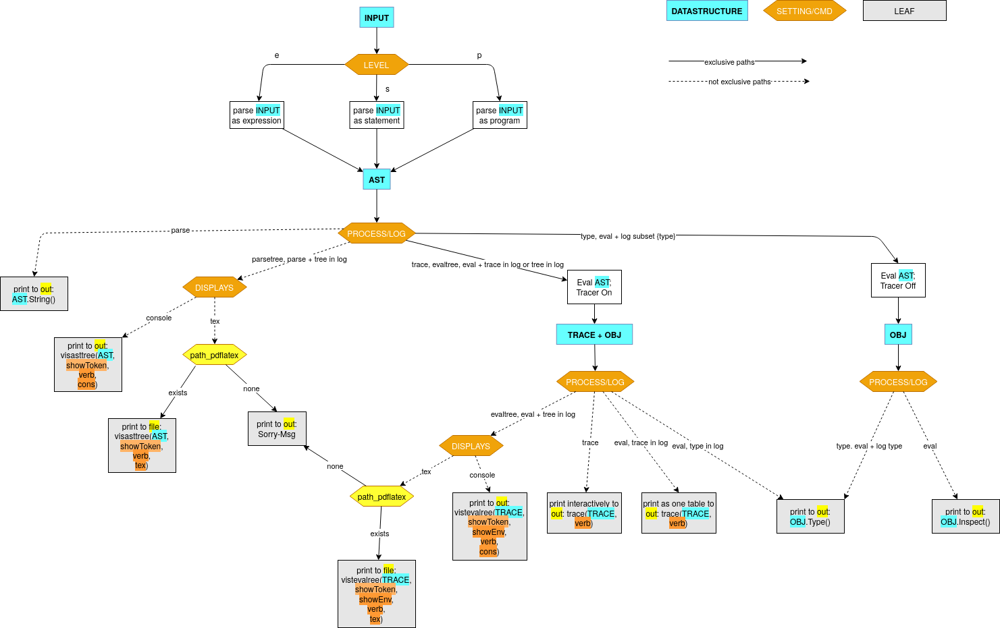

# Commands and Settings 


## Ch-ch-ch-changes

- [X] add c[lear] 
- [X] re-arrange commands in help menu
  - before: in alphabetical order 
  - now: in order of registration
- [X] check paths for "clear" and "pdflatex" at beginning
- [X] add secondary prompt for paste
- [ ] ask for file if not there?
- [ ] write top-level user manual


## Commands new:

```
+----------------+-------------------+----------------------------------------------------------+
| NAME           |                   | USAGE                                                    |
+----------------+-------------------+----------------------------------------------------------+

GENERAL:
| h[elp]         | ~                 | list all commands with usage                             |1
|                | ~ <cmd>           | print usage command <cmd>                                |
| q[uit]         | ~                 | quit the session                                         |2
| cl[earscreen]  | ~                 | clear the terminal screen                                |3

ENVIRONMENT:
| l[ist]         | ~                 | list all identifiers in the environment alphabetically   | 4 -- dependent on verbosity; maybe also on inclenvironment
|                |                   |      with types and values                               |
| c[lear]        | ~                 | clear the environment                                    | 5 # c added

PASTE:
| paste          | ~ <input>         | evaluate multiline <input> (terminated by blank line)    | 6

LEVEL:
| expr[ession]   | ~ <input>         | expect <input> to be an expression                       | 7
| stmt|statement | ~ <input>         | expect <input> to be a statement                         | 8 
| prog[ram]      | ~ <input>         | expect <input> to be a program                           | 9


PROCESS:
| p[arse]        | ~ <input>         | parse <input>                                            | 10
| p[arse]tree    | ~ <input>         | show parsetree                                           | 11
| e[val]         | ~ <input>         | print out value of object <input> evaluates to           | 12
| t[ype]         | ~ <input>         | show objecttype <input> evaluates to                     | 13
| trace          | ~ <input>         | show evaluation trace step by step                       | 14
| e[val]tree     | ~ <input>         | show evaltree                                            | 15

SETTINGS:
| settings       | ~                 | list all settings with their current values and defaults | 16
|                |                   |      for an overview consult :settings and/or :h set     |
| set            | ~ ...             | ...                                                      | 17
| reset          | ~ <setting>       | set <setting> to default                                 | 18
| unset          | ~ <setting>       | set boolean <setting> to false                           | 19
|                |                   |      for an overview consult :settings and/or :h set     |

```

## Settings new:

```
+-----------+---------------+---------------+
| SETTING   | CURRENT VALUE | DEFAULT VALUE |
+-----------+---------------+---------------+
| prompt    | >>            | >>            |--> delete?

| paste     | false         | false         | in {true, false}

| level     | program       | program       | in {program, statement, expression}
| process   | eval          | eval          | in {parse, parsetree, eval, type, trace, evaltree}

| logtree   | false         | false         | in {true, false}
| logtype   | false         | false         | in {true, false}
| logtrace  | false         | false         | in {true, false}

| displays  | cons          | cons          | in {cons, pdf, both}
| verbosity | 0             | 0             | in {0,1,2}
| incltoken | false         | false         | in {true, false}
| inclenv   | false         | false         | in {true, false}
| file      | tree.pdf      | tree.pdf      |FILE
```

## flow 




