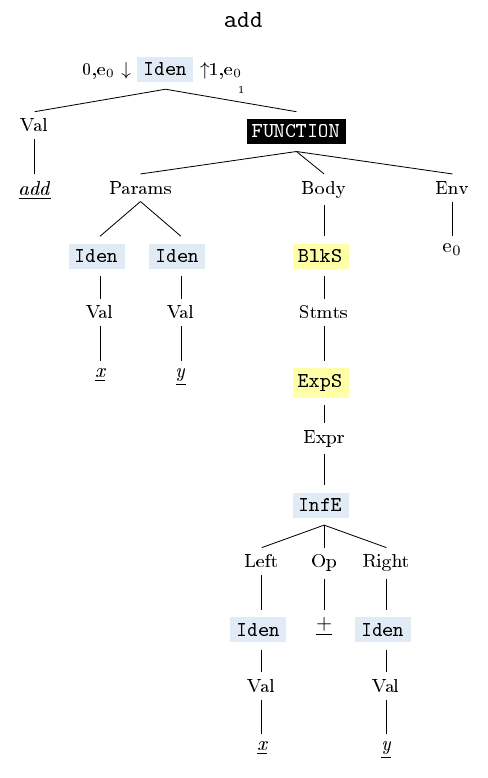

# Closures

## Definition

A closure is a function value that references variables from outside its body. The function may **access** and **assign** to the referenced variables; in this sense the function is "bound" to the variables. 

## Implementation in Monkey 

### Implementation of functions in Monkey

#### Environments

- every node of an ast is evaluated in an environment, which maps identifiers to objects

```
let a = 1
a + 3 
```
#### Function Objects

- every function object has three fields:
  - a list of parameters (variable names)
  - a body (block statement)
  - an environment

```golang 
type Function struct {
	Parameters []*ast.Identifier
	Body       *ast.BlockStatement
	Env        *Environment
}
```
```
let add = fn(x,y){x+y}
add
```



#### Function Calls 

- in a function call, the block statement of the function is evaluated in an **extended environment**, in which the parameters of the function are bound to the arguments of the function call, and which points to the function's environment 

```
let add = fn(x,y){x+y}
add(2,3)
```


- example for use of outer environment:

```
let global = 0
let f = fn(x){global + x}
f(2)
let global = 4
f(2)
```

### Implementations of Closures in Monkey 
- in a closure, the environment of the function object is a special environment that is only accessible from the closure:

```
let newAdder = fn(x) {
  fn(y) { x + y };
};

let addTwo = newAdder(2);
addTwo(2); 
```

```
    +------------+---------+-------+
    | IDENTIFIER | TYPE    | VALUE |
    +------------+---------+-------+
    | y          | INTEGER | 2     |
    +------------+---------+-------+
    --> outer: 
        +------------+---------+-------+
        | IDENTIFIER | TYPE    | VALUE |
        +------------+---------+-------+
        | x          | INTEGER | 2     |
        +------------+---------+-------+
        --> outer: 
            +------------+----------+---------------+
            | IDENTIFIER | TYPE     | VALUE         |
            +------------+----------+---------------+
            | addTwo     | FUNCTION | fn(y) {       |
            |            |          | (x + y)       |
            |            |          | }             |
            | newAdder   | FUNCTION | fn(x) {       |
            |            |          | fn(y) (x + y) |
            |            |          | }             |
            +------------+----------+---------------+
            --> outer: nil
```


### Monkey Limitations

#### An Example in Go

```golang 
package main

import "fmt"

func adder() func(int) int {
	sum := 0
	return func(x int) int {
		sum += x
		return sum
	}
}

func main() {
	f := adder()
	fmt.Println(f(1)) // 0 + 1 = 1
	fmt.Println(f(3)) // 1 + 3 = 4
	fmt.Println(f(3)) // 4 + 3 = 7
}
```

#### Translation to Monkey

```
let adder = fn(){
    let sum = 0
    return fn(x){
        let sum = sum + x
        return sum
    }
}

let f = adder()
f(1)
f(3)
f(3)
```

#### Definition of Closures again

A closure is a function value that references variables from outside its body. The function may **access** and **assign** to the referenced variables; in this sense the function is "bound" to the variables. 

In Monkey, you can only **access** variables from an outer environment, but not **assign** to them. 


