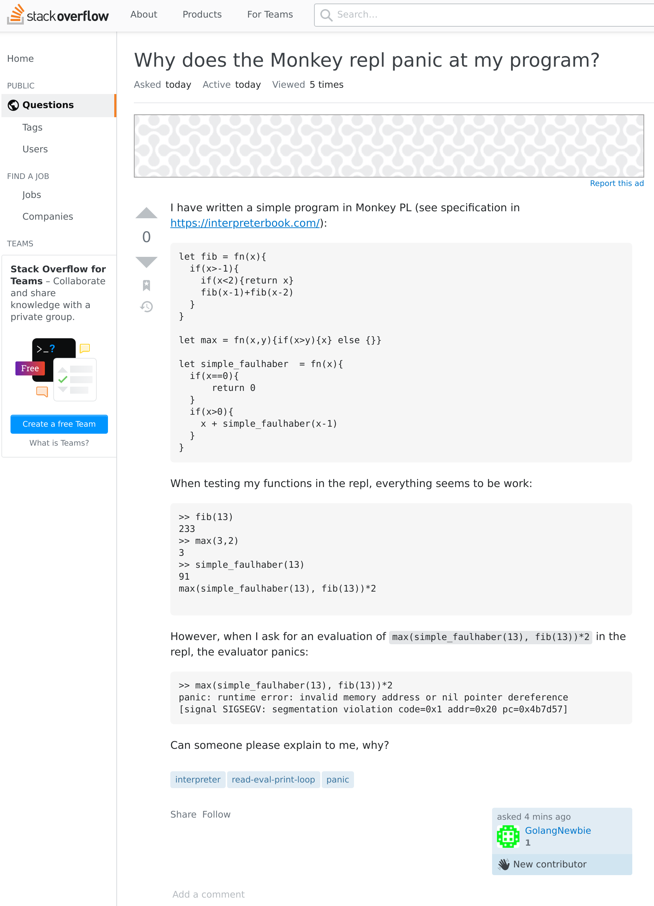
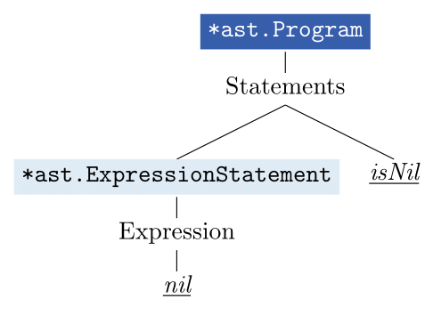
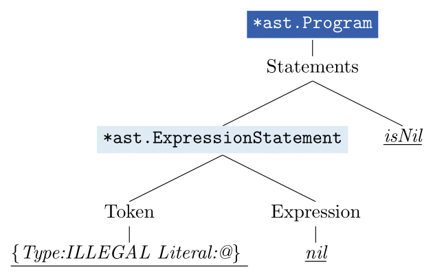
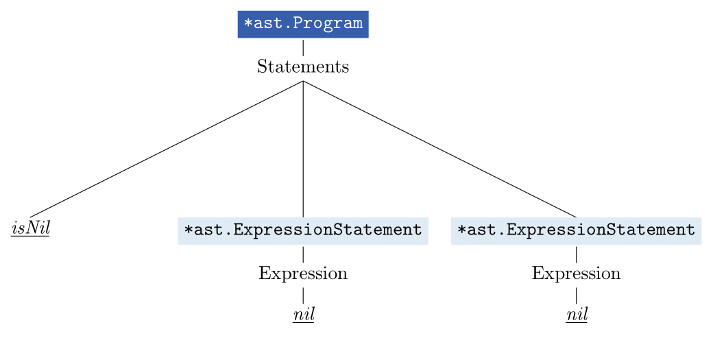
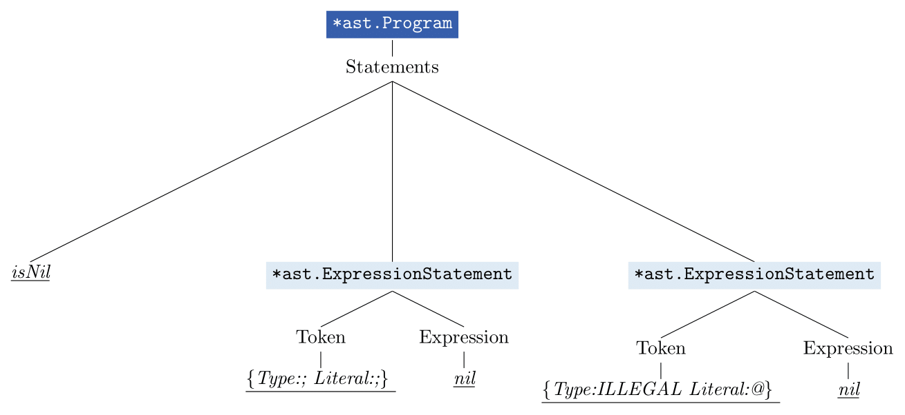

# Testing the evaluator

**Table of contents**
1. [Existing Tests](#existing)
2. [Additional Tests: `evaluator_add_panic_test.go`](#additional_panic)
    1. [TestPanicNotEnoughArguments](#panic_args)
    2. [TestPanicDivisionByZero](#panic_div)
    3. [TestPanicWithNil](#panic_nil)
    4. [TestPanicWithInvalidPrograms](#panic_invalid)
3. [Additional Tests: `evaluator_add_test.go`](#additional)
    1. [TestArityCallExpressions](#arity_call)
    2. [TestDivisionByZero](#div_zero)
    3. [TestEvalToBoolConsistency and TestEvalToBoolCorrectness](#eval2bool)

## Existing Tests: `evaluator_test.go` <a name="existing"></a>

For the evaluator, the majority of tests test only input that is supposed to be valid.

There is one exception: `func TestErrorHandling(t *testing.T)`, which tests type errors.

With regard to the part of Monkey PL introduced in chapter 3, these concerns the following types of type errors (represented by their errormessages):

```
"type mismatch: INTEGER + BOOLEAN"
"unknown operator: -BOOLEAN"
"unknown operator: BOOLEAN + BOOLEAN"
"unknown operator: STRING - STRING"
"identifier not found: foobar"
```

Additionally, there are two tests with hash literals and index expressions, which will be introduced in chapter 4.


## Additional Tests: `evaluator_add_panic_test.go` <a name="additional_panic"></a>

[_Don't panic!_](https://go-proverbs.github.io/)

The tests in this file mainly serve to collect and document all cases that cause the evaluator to panic in its original implementation. The tests excusively check for runtime errors, they do not test anything else.

### `TestPanicNotEnoughArguments` <a name="panic_args"></a>

The interpreter panics at the face of a call expression with not enough arguments.

### `TestPanicDivisionByZero` <a name="panic_div"></a>

The interpreter also panics if we divide a number by zero.

### `TestPanicDivisionByZero` <a name="panic_nil"></a>

First, take a look at [this question](https://stackoverflow.com/questions/66841082/why-does-the-monkey-repl-panic-at-my-program) from stackoverflow:



Can you answer it?

Well, it has to do with the interpreter allowing statements, and thus, expressions to be evaluated to `nil`.

The testcases test programs containing expressions which in turn contain expressions evaluating to `nil`. The testdata can be grouped in three categories:
  - nil as value of the function of a function call
  - nil as value of an operand in a prefix expression with a MINUS operator
  - nil as value of an operand in an infix expression

The tested expressions that (currently) evaluate to `nil` are:
  - `if(true){}`
  - `if(false){}{let a = 1}`
  - `fn(){}()`

These show under which circumstances expressions can evaluate to `nil`: 
when their meaning is derived from evaluating a block statement. 

_When is the meaning of an expression derived from a block statement?_

Under certain circumstances, the meaning of an expression can become the meaning of a block statement. Without looking at the circumstances, this meaning transfer can be illustrated in pseudo-code:

```
Eval(if expression i, env) <-- Eval(i.Consequence, env) 
Eval(if expression i, env) <-- Eval(i.Alternative, env)  
Eval(function call c, env) <-- Eval(Eval(c.Function, env).Body, ext_env)  
```

Consequences and alternatives of if expressions are block statements, as well as bodies of function objects. So the next question is:

_When does a blockstatement evaluate to `nil`?_  
  - when it is empty
  - when its last statement 
    - is a let statement
    - is an expression statement evaluating to `nil`

An expression statement evaluating to `nil` can again derive its meaning directly from a blockstatement like `if(true){}` or indirectly, for example the meaning of the identifier `a` in 
`let b = if(true){}; let a = b`


### `TestPanicWithInvalidPrograms` <a name="panic_invalid"></a>

This test tests the evaluation of defect asts, i.e. asts accompanied by error messages in the parser, which can also cause the evaluator to panic.
It might be discussed whether testing the behaviour of the evaluator when being fed defect asts does not put too high standards on the evaluator, since usually the evaluator will be only used after checking the parser for errors.

To help understand what is the underlying problem in these cases, here are two examples for defect parse trees (with and without token fields):

  - `@ let`

    
    

  - `let;@;`

    

    


**Note the difference between `nil` and `isNil`!**

## Additional Tests: `evaluator_add_test.go` <a name="additional"></a>

There are different approaches to deal with the problems mentioned before, especially those that arise from Monkey allowing programs, statements and expressions to evaluate to `nil`.

This makes it difficult to write further tests with a test design that is reasonable with regard to Monkey's object system, which could be changed in reaction to the discussion before.
It is also difficult, because after a principal revision, the meaning of expressions used as subexpressions in those further tests might differ from what it was before and thus, the test design doesn't work anymore. Luckily, these concerns do not apply to the first two tests in this file:

### `TestArityCallExpressions` <a name="arity_call"></a>

This test specifies how to deal with call expressions that either have not enough or too many arguments.
In the current implementation, the evaluator panics in the first 
case. After this is fixed, we can turn to matters of specification like:
    - do we want to return an error if there are too many arguments?
    - what are the error messages supposed to look like?

This test provides an opportunity to do this. It will only make good sense after this has been done. Right now, there are only stand-in errormessages.

### `TestDivisionByZero` <a name="div_zero"></a>

In the current implementation, dividing a number by zero causes a runtime exception. This is the test to decide what whether we expect such an expression to evaluate to an error object and specify its error message.


### `TestEvalToBoolConsistency` and `TestEvalToBoolCorrectness` <a name="eval2bool"></a>

In the Monkey PL, every non-erroneous expression can be evaluated to a Boolean value. This can be done in two places: 
- in the _Condition_ field of an if expressions
- (implicitly) in the evaluation of a prefix expression with BANG as operator

The first desideratum for the evaluation of expressions in Boolean contexts is **consistency**: we want the evaluation of a condition to a Boolean to be consistent with its evaluation to a Boolean in a prefix expression with a BANG operator.
That means that for any `<expression>`, the evaluation of 

`if (<expression>) {true} else {false}` 

should yield the same result as the evaluation of 

`!!<expression>`.

The second desideratum is **correctness**: we want the evaluations to be correct. What a correct evaluation is varies from language to language and is a matter of language specification. This test serves as an opportunity to discuss exactly that.

Consistency is being tested in `TestEvalToBoolConsistency`, while correctness is being tested in `TestEvalToBoolCorrectness`. 

In the current implementation, `TestEvalToBoolConsistency` succeeds, but that can easily change if we opt to change the implementation, since evaluation to Booleans is implemented twice in the code: for conditions with the help of the function `isTruthy` and for prefix expressions with a BANG operator in `evalBangOperatorExpression`. It thus may serve as a regression test.

`TestEvalToBoolCorrectness` does not suceed, since it needs to be specified correctly first. I wanted to leave the specification open at this stage. A further test could specify and thus test the exact error messages for the cases, in which we expect an expression used in a Boolean context evaluating to an error object.

These two tests try to test all possibilites systematically. It does not rely on specific expressions used in a Boolean context -like `!!fn(x){}()` -, where the evaluation of the argument expression - here `fn(x){}()` - might change, but artificially set up an environment ensuring that under any circumstances, we catch the right object:

#### Test data

We want to test the handling of the following types of `object.Object`s:

object type | values
---|---
`Boolean` | true, false
`Integer` | -1, 0, 1
`Null` | the one and only null object
`Error` | any
`Function` | any

- we will skip `ReturnValue` objects, since they can never be values of expressions and for now all object types that are only introduced in chapter 4: `String`, `Builtin`, `Array` and `Hash`.
- we want to add the infamous `nil`, since expressions in MonkeyPL can still evaluate to `nil` given the current implementation.
- in the given implementation, the only object type for whiches Boolean evaluation it matters, what its value is, is `Boolean`. However, in many languages, when numbers are evaluated to Booleans, their evaluation also varies with regard to their value. Since one might opt for such an implementation for Monkey PL, too, there are three possible values added for integer objects.
- we could use expressions in our testdata that evaluate to the desired objects (e.g. `fn(){}()` for `nil`, `if(false){}`for `NULL`), but this has the drawback that any changes in the evaluation of such expressions will undermine our tests. Thus, we opt for creating an environment mapping the name "a" to the respective values (for example, `TRUE` or `&object.Integer{Value: -1}`) and then use the name in the expression. Here is some example code (not from the actual tests) illustrating how this approach works: 

```go
	env := object.NewEnvironment()
	env.Set("a", &object.Integer{Value: -1})
	input := "!!a"
	l := lexer.New(input)
	p := parser.New(l)
	ast := p.ParseProgram()
	result := Eval(ast, env)
```

