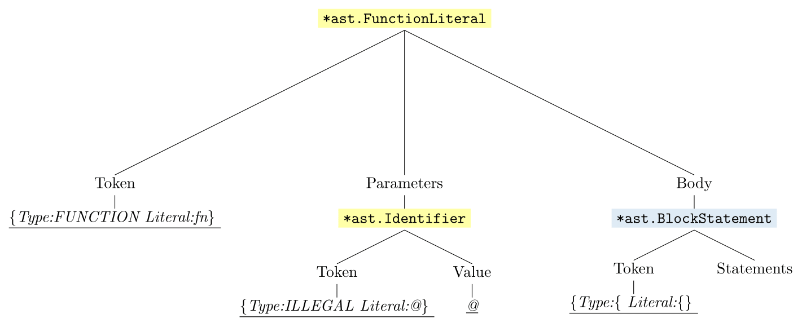

# Testing the parser

**Table of contents**
1. [Existing Tests](#existing)
2. [Additional Tests](#additional)
    1. [TestBlockStatementsParseError](#test1)
    2. [TestFunctionLiteralsInvalidParameterSingle](#test2)
    3. [TestFunctionLiteralsInvalidParameterOutsider](#test3)
    4. [TestFunctionLiteralsInvalidParametersCrowd](#test4)

3. [Asts for a subset of the test data](#asts)
    1. [Asts without the Token fields](#asts_without)
    2. [Asts with the Token fields](#asts_with)

## Existing Tests: `parser_test.go` <a name="existing"></a>

All existing tests only test input that is supposed to be valid.

## Additional Tests: `parser_add_test.go` <a name="additional"></a>

The added tests mainly test certain cases that the parser right now perceives as valid, but that shouldn't be valid in my view.

### `TestBlockStatementsParseError` <a name="test1"></a>

- tests cases of missing right braces in block statements:

    - as part of an if expression: `if(1){1`
    - as part of a function literal: `fn(x,y){x+y`
    - as part of both: `let max = fn(x,y){if(x>y){x}else{y`

### `TestFunctionLiteralsInvalidParameterSingle` <a name="test2"></a>

- tests cases in which random tokens, even illegal ones **(!)** should not be validated as identifier nodes by the parser. 

- selection:

```
fn(@){}     // ILLEGAL
fn(0){}     // INT
fn(=){}     // ASSIGN
fn(!=){}    // NOT_EQ
fn(,){}     // COMMA
fn(fn){}    // FUNCTION
fn(false){} // FALSE
fn(if){}    // IF
fn()){}     // RBRACE
```

- The parser in its current state already rejects `RBRACE` as Parameter, it is just added for completeness

### `TestFunctionLiteralsInvalidParameterOutsider` <a name="test3"></a>

- tests the same parameters surrounded by valid ones, e.g. `fn(a, @, b){}`

### `TestFunctionLiteralsInvalidParametersCrowd` <a name="test4"></a>

- tests a function literal with a lot of invalid parameters followed by an illegal statement (`@`).
- first tests whether there is more than one error reported ( which is not the case right now, but should be)
- then tests whether the last error is the complaint about the illegal end statement
   - thereby wants to test whether the parser parses the input until the end


## Asts for a subset of the test data <a name="asts"></a>


[back](#asts)


input | ast without Token field | ast with Token field
--- | --- | ---
`if(1){1`       | [link](#ast_wo_tok0) | [link](#ast_with_tok0)
`fn(x,y){x+y`   | [link](#ast_wo_tok1) | [link](#ast_with_tok1)
`fn(@){}`       | [link](#ast_wo_tok2) | [link](#ast_with_tok2)
`fn(0){}`       | [link](#ast_wo_tok3) | [link](#ast_with_tok3)
`fn(=){}`       | [link](#ast_wo_tok4) | [link](#ast_with_tok4)
`fn(!=){}`      | [link](#ast_wo_tok5) | [link](#ast_with_tok5)
`fn(,){}`       | [link](#ast_wo_tok6) | [link](#ast_with_tok6)
`fn(fn){}`      | [link](#ast_wo_tok7) | [link](#ast_with_tok7)
`fn(false){}`   | [link](#ast_wo_tok8) | [link](#ast_with_tok8)
`fn(if){}`      | [link](#ast_wo_tok9) | [link](#ast_with_tok9)


### Asts without the Token fields  <a name="asts_without"></a>


- `if(1){1`


 <a name="ast_wo_tok0"></a>

[back](#asts)

---

- `fn(x,y){x+y`


 <a name="ast_wo_tok1"></a>

[back](#asts)

---

- `fn(@){}`


 <a name="ast_wo_tok2"></a>

[back](#asts)

---

- `fn(0){}`


 <a name="ast_wo_tok3"></a>

[back](#asts)

---

- `fn(=){}`


 <a name="ast_wo_tok4"></a>

[back](#asts)

---

- `fn(!=){}`


<a name="ast_wo_tok5"></a>

[back](#asts)
---

- `fn(,){}`


<a name="ast_wo_tok6"></a>

[back](#asts)

---

- `fn(fn){}`


<a name="ast_wo_tok7"></a>

[back](#asts)

---

- `fn(false){}`


<a name="ast_wo_tok8"></a>

[back](#asts)

---

- `fn(if){}`


 <a name="ast_wo_tok9"></a>

[back](#asts)

---


### Asts with the Token fields <a name="asts_with"></a>


- `if(1){1`


 <a name="ast_with_tok0"></a>

[back](#asts)

---

- `fn(x,y){x+y`


 <a name="ast_with_tok1"></a>

[back](#asts)

---

- `fn(@){}`


 <a name="ast_with_tok2"></a>

[back](#asts)

---

- `fn(0){}`


 <a name="ast_with_tok3"></a>

[back](#asts)

---

- `fn(=){}`


 <a name="ast_with_tok4"></a>

[back](#asts)

---

- `fn(!=){}`


<a name="ast_with_tok5"></a>

[back](#asts)

---

- `fn(,){}`


<a name="ast_with_tok6"></a>

[back](#asts)

---

- `fn(fn){}`


<a name="ast_with_tok7"></a>

[back](#asts)

---

- `fn(false){}`


<a name="ast_with_tok8"></a>

[back](#asts)

---

- `fn(if){}`


 <a name="ast_with_tok9"></a>

[back](#asts)

---
