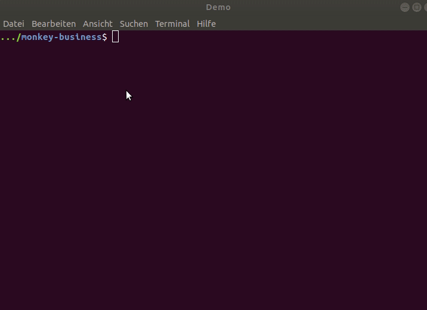
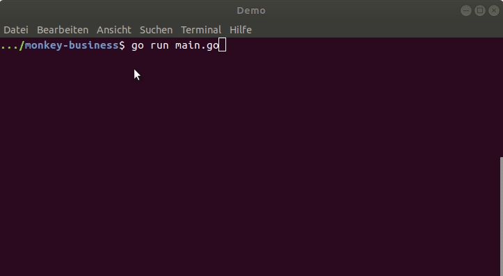

# Extending the REPL/ interactive environment

inspired by [ghci](https://downloads.haskell.org/~ghc/latest/docs/html/users_guide/ghci.html#ghci-commands) and [gore](https://github.com/motemen/gore) 

## Initial Command Set

| NAME   |                   | USAGE                                                   |
|--------|-------------------|---------------------------------------------------------|
| clear    | ~                 | clear the environment                                    |
| e[val]   | ~ `<input>`         | print out value of object `<input>` evaluates to           |
| h[elp]   | ~                 | list all commands with usage                             |
|          | ~ `<cmd> `          | print usage command `<cmd>`                                |
| l[ist]   | ~                 | list all identifiers in the environment alphabetically   |
|          |                   |      with types and values                               |
| paste    | ~ `<input>`         | evaluate multiline `<input>` (terminated by blank line)    |
| q[uit]   | ~                 | quit the session                                         |
| reset    | ~ logtype         | set logtype to default                                   |
|          | ~ paste           | set multiline support to default                         |
|          | ~ prompt          | set prompt to default                                    |
| set      | ~ logtype         | when eval, additionally output objecttype                |
|          | ~ paste           | enable multiline support                                 |
|          | ~ prompt `<prompt>` | set prompt string to `<prompt> `                           |
| settings | ~                 | list all settings with their current values and defaults |
| t[ype]   | ~ `<input>`         | show objecttype `<input>` evaluates to                     |
| unset    | ~ logtype         | when eval, don't additionally output objecttype          |
|          | ~ paste           | disable multiline support                                |

### `clear`, `h[elp]`, `q[uit]`, `set prompt <prompt>`

### `reset prompt`, `list` 

### `t[ype]`,  `(set|unset|reset) logtype`, `e[val]`
- eval is default
    - if the user input is not prefixed by `:`, `input` is equivalent to `:eval input`

### Multiline support: `paste`, `(set|unset|reset) paste` and `settings`

