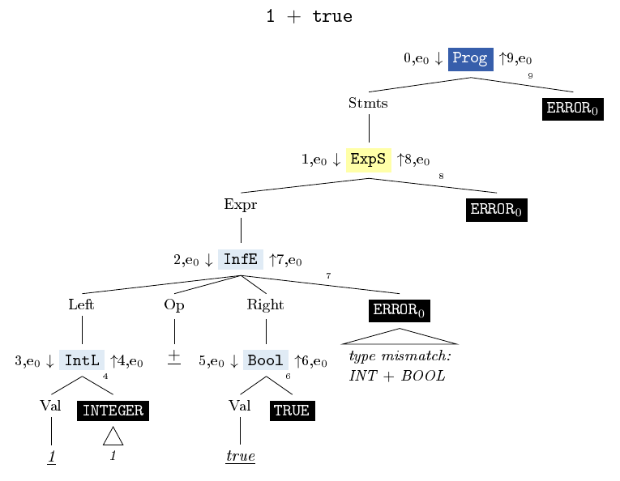
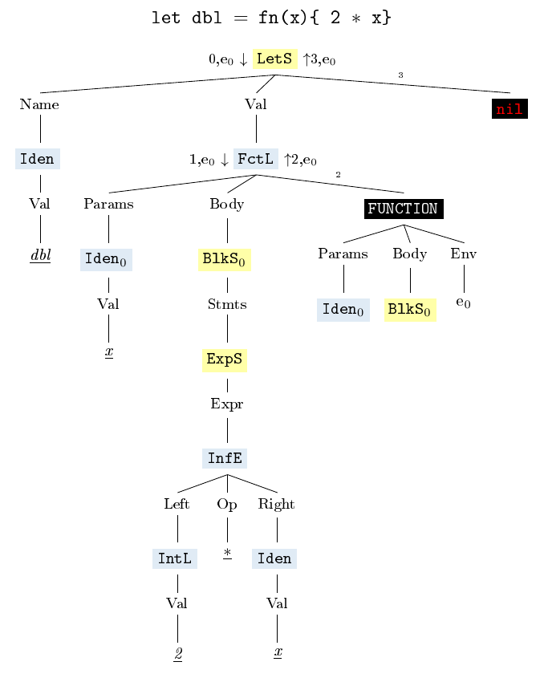
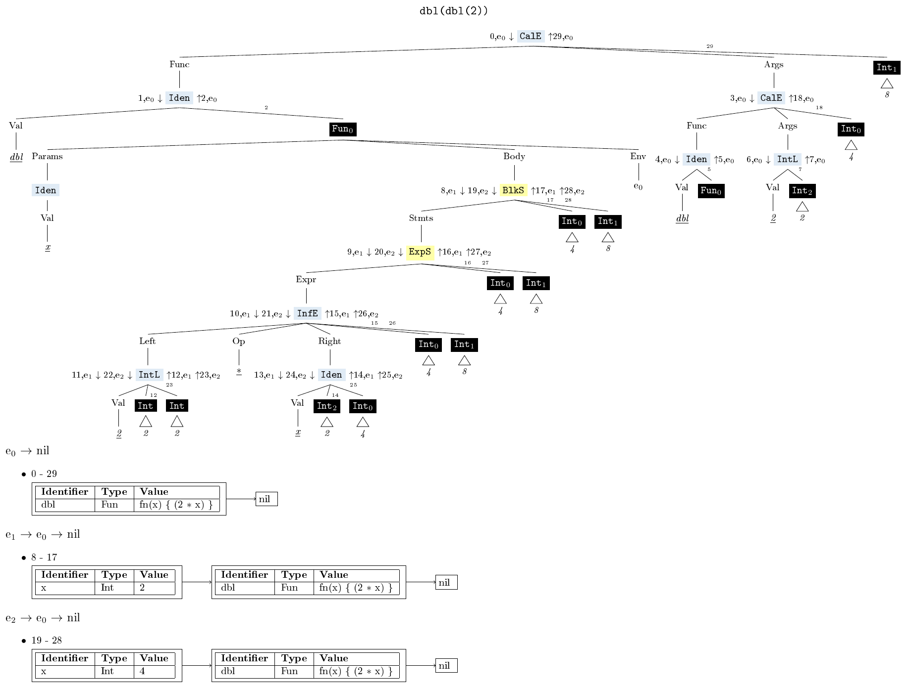

# Visualizing Evaluation

## Constraints
- touch evaluator-code as little as possible
- only works if the evaluator doesn't panic 

## Challenges 

### Circles

Whereas asts are **trees**, asts with the annotation of evaluation steps and objects evaluated to are **dags** or worse, can contain real **cycles**.

They are dags, because 
- several nodes might evaluate to the same object 
- in a let statement defining a function, the parameters and block statement are listed twice 

They might even be cyclic 
- if environments as field values of functions were to be displayed with their mappings

**Solutions**
- if (complex) objects/nodes occur several times, they get a name and are only displayed by their name after their first occurence (expl1, 2)
- environments as field values are only displayed by their name,
  - but there is the option to display all environments that occur in the tree more; then the mapped objects are only displayed by use of their `Inspect()`-methods, which means that for functions, their environment field is not displayed. (expl3)

#### expl1

- same object occurs several times

#### expl2

- same nodes occur several times

#### expl3

- environments may be displayed (setting `inclEnv`)

## Settings/Options

Setting   | Options                 | Default 
---       | ---                     | --
level     | expression / statement / program  | program
inclToken | true / false            | false 
goObjType | true / false            | false
verbosity | 0 / 1 / 2               | 0
inclEnv   | true / false            | false

- `level` determines whether the input is parsed (and thus evaluated and displayed) as a program, a statement or an expression 
- to save space, token fields are not displayed by default. By setting `inclToken`, they are displayed.
- by default, object types are displayed by their Monkey type names. However, this can be changed by setting `goObjType`.
- the verbosity setting determines mainly, how verbose go types are.
- if `inclEnv` is set, all occuring environments are displayed. 
  - All occuring environments:
    - all environments in which a node is evaluated
    - all environments that are field values of function objects 
  - since one and the same environment can change during evaluation, environments are displayed by intervals, in which they stay the same  